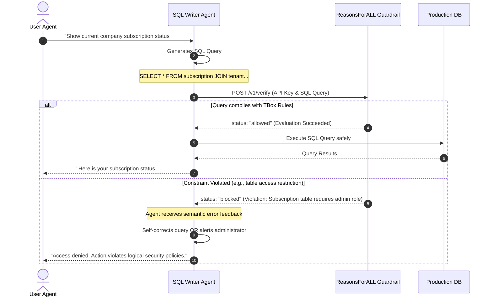

# ReasonsForALL: Multi-Agent Integration Guide

This guide outlines the architecture and implementation patterns for integrating the **ReasonsForALL** logical reasoning guardrail within multi-agent systems (e.g., **Microsoft AutoGen**, **CrewAI**, or **LangGraph**).

---

## 1. The Gatekeeper Architecture

In a multi-agent workflow, agents are specialized and collaborate asynchronously. A typical pattern involves a **SQL Writer Agent** generating database queries and a **DB Executor Tool** running them. 

Without a guardrail, the SQL Writer Agent is prone to **hallucinations** and **jailbreaks** (e.g., executing unauthorized joins or retrieving restricted entities).

ReasonsForALL sits as an **interception middleware** between the query generator and the execution database tool:



---

## 2. Integration Patterns

### Pattern A: Tool Interception (Recommended)
Inject the ReasonsForALL verification directly inside the database execution tool itself. This guarantees that *no agent* can run queries on the database without going through the reasoning gatekeeper.

### Pattern B: Self-Correction Loop
If an agent generates a query that is blocked, feed the semantic reasoning returned by the `/v1/verify` endpoint directly back into the agent's prompt context. The agent can then automatically correct the SQL query to comply with the logical policies.

---

## 3. Framework Implementation Examples

### Example 1: Microsoft AutoGen (Tool Guardrail)

In Microsoft AutoGen, you register a database execution tool. We wrap this tool with a check against the `/v1/verify` API:

```python
import httpx
from autogen import ConversableAgent, register_function

# 1. Define the gatekeeper verification function
def verify_and_execute_query(sql_query: str) -> str:
    """
    Intercepts, validates, and safely executes SQL queries through ReasonsForALL.
    """
    RFA_API_KEY = "sk-rfa-..."
    SERVER_ID = "production-db-456a"
    
    # Verify query with ReasonsForALL logical guardrail
    try:
        with httpx.Client() as client:
            response = client.post(
                "https://api.reasonsforall.com/v1/verify",
                headers={
                    "Authorization": f"Bearer {RFA_API_KEY}",
                    "Content-Type": "application/json"
                },
                json={
                    "server_id": SERVER_ID,
                    "agent_query": sql_query,
                    "context": {
                        "user_id": "usr_active_agent",
                        "session_role": "analyst"  # Dynamic context
                    }
                },
                timeout=5.0
            )
            
            validation = response.json()
            
            if validation.get("status") == "blocked":
                # Block execution and return the reasoning directly to the agent
                reasoning = validation.get("reasoning")
                return f"EXECUTION BLOCKED by Guardrail: {reasoning}. Please correct your query."
                
    except Exception as e:
        # Fail-closed policy: block query if the guardrail service is unreachable
        return f"EXECUTION BLOCKED: Guardrail verification unavailable ({str(e)})."

    # If allowed, proceed to execute the query
    return execute_raw_db_query(sql_query)

def execute_raw_db_query(query: str) -> str:
    # Your database connection execution logic here
    return "[Database Row Results]"

# 2. Register the tool with the Executor and SQL Writer agents
writer_agent = ConversableAgent(
    name="SQL_Writer",
    system_message="You generate SQL queries to solve user questions. Use the query tool to run them.",
    llm_config={"config_list": [{"model": "gpt-4", "api_key": "..."}]}
)

executor_agent = ConversableAgent(
    name="DB_Executor",
    system_message="You execute SQL queries requested by the SQL Writer agent.",
    human_input_mode="NEVER"
)

# Register function so that execution is always validated
register_function(
    verify_and_execute_query,
    caller=writer_agent,
    executor=executor_agent,
    name="run_sql_query",
    description="Validate and run an SQL query against the connected company database."
)
```

---

### Example 2: CrewAI / LangChain (Custom Tool Guardrail)

For CrewAI, LangChain, or other LLM frameworks, we define a custom Structured Tool that performs verification:

```python
from langchain.tools import tool
import httpx

@tool("validated_database_query_tool")
def validated_query_tool(sql_query: str) -> str:
    """
    Verifies the SQL query using ReasonsForALL logic guardrails prior to execution.
    Use this tool whenever you need to fetch records or information from the database.
    """
    RFA_API_KEY = "sk-rfa-..."
    SERVER_ID = "production-db-456a"
    
    headers = {
        "Authorization": f"Bearer {RFA_API_KEY}",
        "Content-Type": "application/json"
    }
    
    payload = {
        "server_id": SERVER_ID,
        "agent_query": sql_query,
        "context": {
            "user_id": "agent_worker_01",
            "access_tier": "standard"
        }
    }
    
    # Intercept query
    res = httpx.post("https://api.reasonsforall.com/v1/verify", headers=headers, json=payload)
    result = res.json()
    
    if result.get("status") == "blocked":
        # Return logical reasoning to trigger the self-correction loop in CrewAI
        return (
            f"Error: Query rejected by ReasonsForALL Guardrail.\n"
            f"Reasoning: {result.get('reasoning')}\n"
            f"Please revise your SQL query logic to comply with schema constraints."
        )
        
    # Execute query safely
    return "Query executed. Records retrieved successfully."
```

---

## 4. Key Advantages of the ReasonsForALL Multi-Agent Setup

1. **Deterministic Security**: Multi-agent systems can bypass typical vector-based guardrails through prompt injection. ReasonsForALL uses formal Description Logics (TBox) to enforce deterministic security that LLMs cannot jailbreak.
2. **Self-Healing Agents**: By feeding the semantic `reasoning` response string back to the LLM agent upon a block, the agent can understand *why* its database schema join or query was logical nonsense or out-of-bounds, self-correcting the query in the next execution turn without human developer intervention.
3. **Decentralized Policies**: Keep your guardrail policies isolated within ReasonsForALL's semantic dashboard, avoiding hardcoding intricate schema-validation rules inside agent prompt systems.
